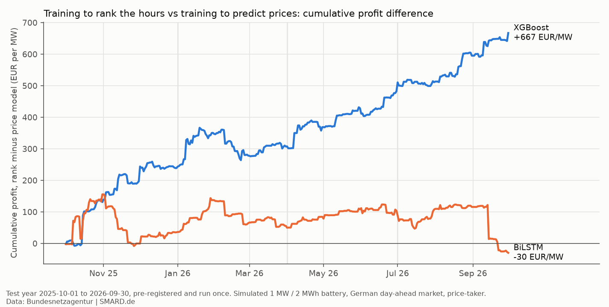
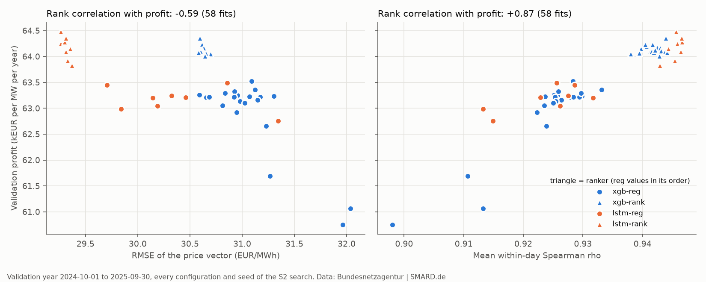

# bess-rank: learning to rank the hours for battery trading

*For a battery, the order of the hours matters more than their prices.*

- **Question.** Does training a model to rank the hours of each day, instead of predicting their
  prices, earn more money for a simulated 1 MW / 2 MWh battery, German day-ahead market,
  price-taker?
- **Result.** Training XGBoost to rank the hours earned +667 €/MW/yr more than training it to
  predict prices (+1.0%, 95% CI +285 to +1,036), closing 16% of the gap to perfect foresight.
  Pre-registered, tested once on a locked year. For the BiLSTM, ranking made no detectable
  difference.
- **Accuracy is not value (exploratory).** Across 58 validation fits, how well a model orders the
  hours of each day predicts its profit far better than its RMSE does (rank correlation with
  profit +0.87 vs −0.59).



*Fig. 1. Extra profit of the ranked strategy over the price-model strategy, added up over the
locked test year (2025-10-01 to 2026-09-30), per MW. Both strategies of a family use the same
forecast values, only in a different order. XGBoost ends at +667 €/MW, the BiLSTM at −30 €/MW.*

## The idea in one minute

A battery on the day-ahead market earns money in a simple way: it charges in the cheapest hours
of tomorrow and discharges in the most expensive ones. To plan that, it does not really need to
know whether 18:00 will cost 210 or 230 €/MWh. It needs to know that 18:00 is one of the most
expensive hours of the day.

Price forecasts, though, are usually trained and judged on RMSE, which punishes errors in the
price *level*. A model can have a good RMSE and still put two hours in the wrong order, and the
order is what moves money. So I asked: if I train the same model to *rank* the hours of each day
instead, does the battery earn more?

## How I tested it

- **Data.** Public SMARD data (Bundesnetzagentur), Germany-Luxembourg, hourly: day-ahead prices,
  the grid operators' forecasts of load, wind and solar, and actual load and residual load.
  Training 2019-01-01 to 2024-09-30, validation the next year, test 2025-10-01 to 2026-09-30
  (365 days). From 2025-10-01 the 15-minute prices are averaged to hours.
- **No peeking at the future.** The plan for day D is fixed at 11:00 on D-1, one hour before the
  auction closes. Each of the 42 features declares when its data become available, and a test
  rebuilds the features of 43 days from only the data visible at that time and checks that
  nothing changes.
- **Four models (2×2).** XGBoost and a BiLSTM (bidirectional LSTM), each trained either to
  predict prices (squared error) or to rank the hours of each day (a pairwise loss over every
  pair of hours). Hyperparameters were chosen on the validation year by RMSE or within-day
  Spearman ρ, never by profit; every model was refitted each test quarter with 3 seeds.
- **A fair comparison.** A ranker outputs an order, not prices, so the "-rank" strategy hands
  the price model's values for the day out in the ranker's order. Both strategies hold exactly the
  same numbers, so any profit difference comes from the order alone. Toy example with 4 hours:

  | Hour | Actual price | Price model | Ranker's order (1 = cheapest) | Ranked vector |
  |---|---|---|---|---|
  | 1 | 20 | 30 | 1 | 30 |
  | 2 | 60 | 45 | 3 | 55 |
  | 3 | 40 | 55 | 2 | 45 |
  | 4 | 90 | 80 | 4 | 80 |

  The price model swaps hours 2 and 3; the ranker gets them right, so the battery would sell in
  hour 2 instead of hour 3.
- **The battery.** Each day is planned by a small mixed-integer program (scipy/HiGHS): 88% round
  trip, at most one full cycle per day, 50% charge at the start and end of each day, 10 €/MWh
  degradation. The plan is made on the strategy's price vector and paid at the actual prices. As
  a safety net, OR-Tools/SCIP solves every day again and the run stops if the solvers disagree
  (beyond 1e-6 relative) or if any strategy beats perfect foresight.
- **Pre-registration.** Before I saw a single test-year price, I wrote down the hypotheses, the
  statistics, the decision rules and every setting in [PLAN.md §6](PLAN.md) and merged it (tag
  `prereg`); until then the data checks on the test year only reported counts and pass/fail. The
  code refuses to load test data unless `BESS_UNLOCK_TEST=1` is set and `PREREGISTRATION.lock`
  holds a commit hash, and the test run refuses to start if the code differs from the locked
  commit or to overwrite its results. The test ran once (tag `confirmatory-run`). This is how I
  made sure I could not tune anything after seeing the answer.
- **Error bars.** Neighbouring days are correlated, so resampling single days would make the
  intervals too narrow. Every 95% CI comes from a moving-block bootstrap over the 365 test days
  (7-day blocks, 10,000 resamples).

## Results (test year, pre-registered)

| Strategy | Price vector the battery plans on | Profit (€/MW/yr) | Capture | RMSE (€/MWh) |
|---|---|---|---|---|
| S-perfect | actual prices (upper bound) | 73,181 | 100.0% | 0 |
| S-naive-1d | prices of the day before | 60,390 | 82.5% | 47.34 |
| S-naive-7d | prices of a week before | 57,936 | 79.2% | 57.46 |
| S-xgb-reg | XGBoost price forecasts | 69,107 | 94.4% | 30.26 |
| S-xgb-rank | the same values, in XGBoost-ranker order | 69,774 | 95.3% | 30.01 |
| S-lstm-reg | BiLSTM price forecasts | 69,864 | 95.5% | 28.50 |
| S-lstm-rank | the same values, in BiLSTM-ranker order | 69,834 | 95.4% | 28.38 |

Capture is the share of the perfect-foresight profit a strategy gets. The full table (VaR, ES,
drawdown, hit rates) is in [`results/test_summary.md`](results/test_summary.md).

**The three pre-registered hypotheses:**

- **H1 (the main test): supported.** S-xgb-rank − S-xgb-reg = +1.83 €/day (95% CI 0.78 to 2.84),
  i.e. +667 €/MW/year (+0.97%). Exploratory checks afterwards (not tests):
  - the gain is positive in every quarter: +2.60, +0.76, +1.93 and +2.01 €/day;
  - with both models' tree counts fixed to their validation values (no early stopping), the gain
    is +1.30 €/day (0.36 to 2.36): about 0.5 €/day of the official effect came from unstable early
    stopping, mostly XGB-reg's (fixing the trees raises S-xgb-reg by 0.69 €/day, S-xgb-rank by
    0.15);
  - caveat: the grid operators' wind and solar forecasts are only due by 18:00 on D-1, after the
    12:00 auction. Without them both XGBoost strategies earn 5–6% less, and the gain from ranking
    grows to +4.38 €/day (2.20 to 6.51).
- **H2: inconclusive.** The ranked vector's RMSE was lower, not equal: −0.25 €/MWh (95% CI −0.37
  to −0.14) against a ±0.30 €/MWh equivalence margin.
- **H3: inconclusive.** No detectable difference for the BiLSTM: S-lstm-rank − S-lstm-reg =
  −0.08 €/day (95% CI −1.19 to 1.03).
- *Exploratory:* S-xgb-rank − S-lstm-reg = −0.25 €/day (95% CI −1.61 to 1.14). The BiLSTM price
  model on its own already earns about as much as the XGBoost ranker.


*Fig. 2. 2025-10-15, picked because it is the test day on which the two XGBoost strategies differ
most (+90 €), so it is the extreme case, not a typical day (the average gain is +1.83 €/day). The
price model put its highest values in the evening; the ranker put them on the morning peak, which
was the real one, and the battery sold there. Over the year the two schedules differ on 294 of
365 days: the ranked one earns more on 178 and less on 116.*



*Fig. 3. Validation year, 58 fits (every configuration and seed of the hyperparameter search).
Profit against RMSE (left) and against the mean within-day Spearman ρ between forecast and
actual prices (right). Triangles are rankers, shown through their reordered price vectors. It
holds within each price model: within-day ρ +0.77 vs RMSE −0.36 for XGBoost, +0.50 vs −0.07 for
the BiLSTM.*

## What else I found (exploratory)

These analyses came after the test and are not pre-registered. The details are in
[VALIDATION.md](VALIDATION.md), which I wrote like a bank's model validation report.

- **Where the money is lost:** the order of the hours explains 7.6 of the 11.2 €/day S-xgb-reg
  leaves on the table; the BiLSTM price model already orders the hours almost as well as the
  XGBoost ranker, which is why ranking did not help it ([§7.2](VALIDATION.md#72-where-is-the-money-lost)).
- **The BiLSTM's bad summer is mostly one day:** 2026-09-14 accounts for −108 € of the
  Jul–Sep 2026 quarter's −134 € ([§7.2](VALIDATION.md#72-where-is-the-money-lost)).
- **Drift:** price-level features shift a lot between training and test (PSI 1.05–1.72), the
  within-day rank and profile features stay stable (0.00–0.07), and the ranker's top feature
  shifts moderately (0.17) ([§6](VALIDATION.md#6-is-it-stable-over-time)).
- **Conformal quantiles:** after calibration on the validation year, the 90% interval covers
  88.6% of test hours (85.0% before) ([§7.4](VALIDATION.md#74-risk-aware-schedules-conformal-quantiles-and-cvar)).
- **Risk-averse schedules, a negative result:** CVaR schedules lose 5–19% of mean profit without
  improving the realized expected shortfall ([§7.4](VALIDATION.md#74-risk-aware-schedules-conformal-quantiles-and-cvar)).

## Running it on Databricks

To check that the result does not depend on my machine, the official XGBoost test pipeline also
runs as the Databricks job `bess-rank-pipeline` on serverless compute (Free Edition).
`python -m bessrank.run pipeline` uploads one commit's code to the volume `workspace.bess.raw` and
runs [`notebooks/01_pipeline.py`](notebooks/01_pipeline.py), a thin wrapper around
[`bessrank.pipeline`](src/bessrank/pipeline.py) ([job definition](notebooks/bess-rank-pipeline.job.json)).
The test lock applies there too.

- **Outputs:** four Delta tables in `workspace.bess`, each row tagged with the commit:
  `gold_features` (8,760 rows), `gold_predictions` (8,760), `gold_schedules` (43,800) and
  `gold_daily_profit` (1,825), plus 24 fit runs and a summary run in the MLflow experiment
  `bess-rank`.
- **Same answer:** run 967734030312010 (commit 4cd8d8a, 5.9 min in the notebook) reproduced all
  24 fits' forecasts exactly (largest difference 0.0) and the daily profits within 2.3e-13 € on
  all 365 days; H1 from the Databricks numbers is +1.83 €/day (95% CI 0.78 to 2.84)
  ([details](results/databricks_pipeline.json)).
- The BiLSTM stays local: it would need torch on serverless, and its refits took most of the
  test run's 19 minutes, while Free Edition compute has daily quotas.

## Reproduce

```bash
python -m venv .venv && source .venv/bin/activate
pip install -r requirements.txt
python -m bessrank.run data      # rebuild data/ from the Databricks volume, or download from SMARD
python -m bessrank.run qa        # data quality report (test period: counts and pass/fail only)
python -m bessrank.run features  # feature table (train + validation; the test year stays locked)
python -m bessrank.run tune xgb-reg   # validation-year search; also xgb-rank, lstm-reg, lstm-rank
python -m bessrank.run validate  # validation-year strategies and the table of every configuration
pytest
```

The test year is locked: test data load only when `BESS_UNLOCK_TEST=1` is set and
`PREREGISTRATION.lock` holds a commit hash (the committed one is the pre-registration merge,
517478e).

```bash
BESS_UNLOCK_TEST=1 python -m bessrank.run explore forecasts       # refit all 48 test models, compare
BESS_UNLOCK_TEST=1 python -m bessrank.run explore xgb-variants    # no-TSO and fixed-tree refits
BESS_UNLOCK_TEST=1 python -m bessrank.run explore analyses        # the VALIDATION.md analyses
BESS_UNLOCK_TEST=1 python -m bessrank.run explore conformal-cvar  # conformal quantiles and CVaR
BESS_UNLOCK_TEST=1 python -m bessrank.run report                  # the three figures above
```

A fresh machine reproduced all 48 test fits and the daily profits to within 2.3e-13 €. The exact
code of the test run is at tag `confirmatory-run`; package versions, the SMARD download time and
the commit of every stage are in [`results/provenance.json`](results/provenance.json).

## Limitations

- It is a simulation: a 1 MW / 2 MWh price-taker battery with a linear degradation cost, whose
  plans are assumed to clear, on the day-ahead market only (no intraday or balancing revenue, no
  fees or grid charges).
- The grid operators' wind and solar forecasts may not be available at 11:00 on D-1. They stand
  in for the vendor forecasts a trader would buy; without them the two XGBoost strategies earn
  5–6% less (the BiLSTM was not re-tested).
- No fuel or carbon prices; lagged prices carry the price level.
- 15-minute prices from 2025-10-01 are averaged to hours.
- One market and one test year.

## Next steps

- Train through the battery program itself with a decision-focused loss (e.g. SPO+), instead of
  the pairwise ranking loss, which is only a proxy for the order that matters to the schedule.
- Intraday markets and 15-minute products.
- Other bidding zones and other years.

## Repository

- [`PLAN.md`](PLAN.md): design, pre-registration (§6) and lab notebook (§12).
- [`RULES.md`](RULES.md): the study's hard rules (test lock, no look-ahead, controlled
  comparisons, sanity assertions, reproducibility).
- [`VALIDATION.md`](VALIDATION.md): model validation report and every exploratory analysis.
- [`src/bessrank/`](src/bessrank/): one module per stage; [`tests/`](tests/): the test suite.
- [`results/`](results/): committed results (no SMARD data); [`results/explore/`](results/explore/)
  holds the exploratory tables and figures.

---

Data: Bundesnetzagentur | SMARD.de

Author: Akram M. Lrhorfi.

Code: [MIT License](LICENSE).
