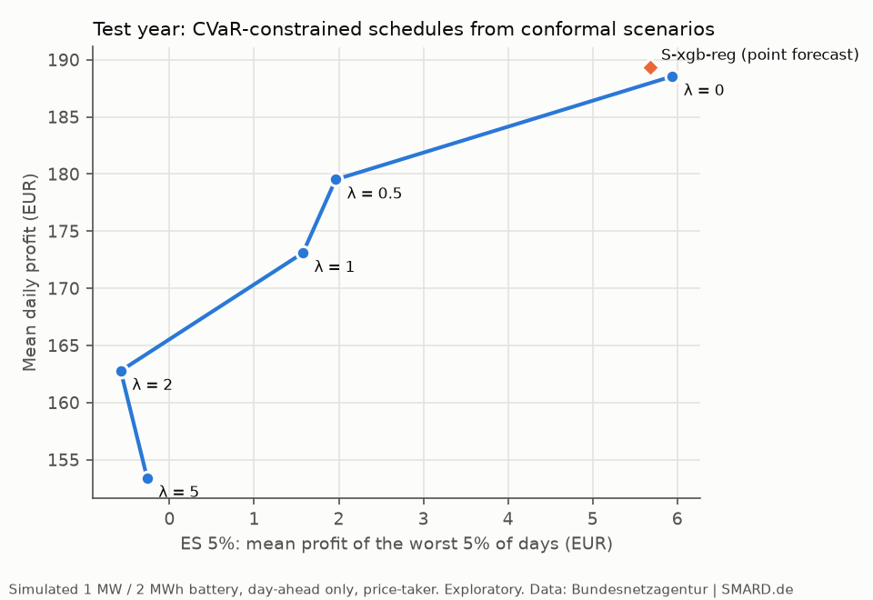

# Model validation report

Written in session S4 (PLAN.md §8), in the style of a bank's model-risk review. The subject is a
research pipeline, not a trading system: a simulated 1 MW / 2 MWh battery trades the German
day-ahead market (DE-LU) only, as a price-taker.

Everything after the pre-registered test run is **exploratory**. The verdicts on H1–H3 come from
the single pre-registered run (`results/test_summary.md`) and are quoted here as they are. The
exploratory numbers are in `results/explore/` (`summary.md` holds every table, the CSV files the
raw numbers).

## Summary

- **H1 supported: +1.83 €/day (95% CI 0.78 to 2.84), +667 €/MW/year (+0.97%).** S-xgb-rank
  closes 16.4% of S-xgb-reg's gap to perfect foresight (667 of 4,074 €/MW/year).
- **The ranked vector's RMSE was lower, not equal (H2 inconclusive):** −0.25 €/MWh, 95% CI
  −0.37 to −0.14, against a ±0.30 €/MWh equivalence margin.
- **No difference for the LSTM (H3 inconclusive):** −0.08 €/day, 95% CI −1.19 to 1.03.
- **Exploratory checks** (not tests, sections 6–9):
  - the XGBoost rank − reg difference keeps a CI above 0 under every battery setting tested
    (+1.16 to +2.73 €/day; degradation 0 and 20 €/MWh, 1 h and 4 h batteries);
  - without TSO generation forecasts both XGBoost strategies lose 5–6% of profit, and rank − reg
    grows to +4.38 €/day (2.20 to 6.51);
  - with both models' validation tree counts fixed at every refit, rank − reg is +1.30 €/day
    (0.36 to 2.36): about 0.5 €/day of the official effect came from early stopping at the
    refits, mostly XGB-reg's (fixing the trees raises S-xgb-reg by 0.69 €/day, S-xgb-rank by
    0.15);
  - order is two-thirds of S-xgb-reg's gap to perfect foresight (7.6 of 11.2 €/day). The BiLSTM
    price model already orders the hours almost as well as XGB-rank, which is why the LSTM ranker
    adds nothing; its Jul–Sep 2026 loss is mostly one day (2026-09-14, −108 € of −134 €);
  - stretch: CVaR-constrained schedules from conformal scenarios lower both the mean profit
    (−5% to −19%) and the realized ES on the test year; only the drawdown improves.

## 1. Purpose and scope

- **Question.** Does a model trained to rank the hours of each delivery day earn more simulated
  battery profit than the same model family trained to predict prices, when both feed the same
  daily battery program? The design is a 2×2: XGBoost or bidirectional LSTM, price or rank
  objective (PLAN.md §1, §4).
- **Controlled comparison.** A "-rank" strategy keeps the price model's forecast values for the
  day and reassigns them to hours in the ranker's order (PLAN.md §5). Within a family only the
  within-day order differs; forecast values, battery and settlement are shared.
- **Intended use.** Research evidence on training objectives for storage arbitrage. Out of
  scope: intraday and balancing markets, bidding strategy and market impact, fees and grid
  charges, battery ageing beyond a linear cost per MWh discharged.
- **Model outputs reviewed.** Hourly price forecasts (XGB-reg, LSTM-reg), within-day scores
  (XGB-rank, LSTM-rank), the price vectors of seven strategies, the daily schedules of a
  mixed-integer program, and daily profit settled at the actual prices.

## 2. Data and quality

- **Source.** SMARD chart API (Bundesnetzagentur | SMARD.de): day-ahead price (4169), TSO
  day-ahead forecasts of load (411), onshore wind (123), offshore wind (3791) and PV (125), actual
  load (410) and actual residual load (4359), hourly, DE-LU. Download time and versions are in
  `results/provenance.json`.
- **Periods.** Train 2019-01-01 → 2024-09-30 (2,092 days after dropping 8 gap days), validation
  2024-10-01 → 2025-09-30, test 2025-10-01 → 2026-09-30 (365 days, locked until the
  pre-registration was merged; PREREGISTRATION.lock = 517478e).
- **Checks** (`results/qa_data.md`). 0 duplicate or off-grid timestamps. Gaps of 1–2 hours are
  interpolated and flagged (the 00:00 hour SMARD misses on 25-hour days); longer gaps drop the
  training day only. The test period passes every format check: 365 days and 8,760 hours, DST
  days with 23 and 25 hours, 2 hours filled (wind onshore and PV on 2025-10-26), 0 days with a
  missing value after filling, every hour with 4 quarter-hour prices, and SMARD's hourly price
  equal to the quarter-hour mean within 0.01 €/MWh on all 8,760 hours.
- **The 15-minute market** (from 2025-10-01). The study stays hourly: the hourly price is the
  mean of the four quarter-hour prices, which is exact for a battery holding constant power within
  each hour. A quarter-hour battery could earn more; that extension was cut (PLAN.md §8).
- **Identity checks.** Wind + PV forecast = SMARD's 5097 and forecast residual load = 4362, both
  with a maximum difference of 0.0 MWh on a training week. 411 behaves like a day-ahead load
  forecast (MAPE 3.86% against actual load); the label is not exposed by the API.

## 3. Conceptual soundness and assumptions

- **Decision time and look-ahead.** The decision for day D is taken at 11:00 Europe/Berlin on
  D-1. Every feature declares its availability rule in `features.py`; `tests/test_features.py`
  deletes everything after the cut-off, recomputes the features for 37 real and 6 synthetic days,
  and asserts identical values.
- **TSO generation forecasts (caveat).** EU Regulation 543/2013 only requires wind and solar
  forecasts for D by 18:00 on D-1, after the 12:00 auction. They are used as a proxy for the
  morning vendor forecasts a trader would buy (as in the epftoolbox literature). Section 7 tests
  the pipeline without them.
- **Battery program.** One MILP per day (23, 24 or 25 hours): 88% round trip, 50% charge at the
  start and end of each day, at most one full cycle per day, 10 €/MWh degradation, and a binary
  per hour that forbids charging and discharging at once (with negative prices an LP would burn
  energy). HiGHS (scipy) and SCIP (OR-Tools) solve every day to a relative gap of 0 and must agree
  within 1e-6, and perfect foresight must be ≥ every strategy on every day; both checks held on
  every solve in S1–S4.
- **Settlement.** The schedule is computed on the strategy's price vector and settled at the
  actual prices. Price-taker: a 1 MW battery does not move a market of about 50–60 GW.
- **Models.** XGBoost 3.2.0 (`reg:squarederror`; `rank:pairwise` over every within-day pair of
  hours, checked against a hand-written gradient) and a 2-direction LSTM over each day's hours
  (masked MSE or the same pairwise logistic loss). Hyperparameters were chosen on the validation
  year by RMSE or within-day Spearman ρ, never by profit (PLAN.md §7).
- **Uncertainty.** Every CI is a moving-block bootstrap over days (7-day blocks, 10,000
  resamples, seed 20261004), never over hours, so serial dependence between days is kept.

## 4. Outcome analysis (test year, 2025-10-01 → 2026-09-30)

**Pre-registered verdicts** (`results/test_summary.md`; final, quoted as they are). H1 is the
only confirmatory test; H2 and H3 are secondary, without multiplicity adjustment.

| Hypothesis | Statistic | Estimate | 95% CI | Verdict |
|---|---|---|---|---|
| H1 (confirmatory) | S-xgb-rank − S-xgb-reg, mean daily profit (€/day) | +1.83 | 0.78 to 2.84 | supported |
| H2 (secondary) | RMSE(S-xgb-rank) − RMSE(S-xgb-reg) (€/MWh), margin ±0.30 | −0.25 | −0.37 to −0.14 | inconclusive |
| H3 (secondary) | S-lstm-rank − S-lstm-reg, mean daily profit (€/day) | −0.08 | −1.19 to 1.03 | inconclusive |
| LSTM RMSE (descriptive) | RMSE(S-lstm-rank) − RMSE(S-lstm-reg) (€/MWh), margin ±0.29 | −0.12 | −0.18 to −0.04 | no test |

H1 supported: +1.83 €/day (95% CI 0.78 to 2.84), +667 €/MW/year (+0.97%). S-xgb-rank closes
16.4% of S-xgb-reg's gap to perfect foresight (667 of 4,074 €/MW/year), and is better on 178
days and worse on 116. The ranked vector's RMSE was lower, not equal (H2 inconclusive): its CI
lies below 0 and crosses −0.30, so it cannot rule out a fall of more than 1%. No difference for
the LSTM (H3 inconclusive). The §1 headline, which needed H1 and H2 both supported, is not used.

**Every strategy** (test year; VaR 5% = P5 of daily profit, ES 5% = mean of the worst 5% of
days, 19 of 365; both profit levels, negative = loss):

| Strategy | Profit (€/MW/year) | Capture | RMSE (€/MWh) | Spearman ρ | VaR 5%: P5 (€) | ES 5%: worst 5% (€) | Losing days | Max drawdown (€) |
|---|---|---|---|---|---|---|---|---|
| S-perfect | 73,181 | 100.0% | 0 | 1 | 21.73 | 14.73 | 0.0% | 0 |
| S-naive-1d | 60,390 | 82.5% | 47.34 | 0.781 | −7.57 | −23.79 | 7.9% | 61.4 |
| S-naive-7d | 57,936 | 79.2% | 57.46 | 0.794 | −2.58 | −25.55 | 6.6% | 222.3 |
| S-xgb-reg | 69,107 | 94.4% | 30.26 | 0.936 | 14.82 | 5.68 | 1.1% | 16.0 |
| S-xgb-rank | 69,774 | 95.3% | 30.01 | 0.952 | 15.17 | 6.26 | 0.8% | 13.1 |
| S-lstm-reg | 69,864 | 95.5% | 28.50 | 0.945 | 14.78 | 6.90 | 0.5% | 11.3 |
| S-lstm-rank | 69,834 | 95.4% | 28.38 | 0.954 | 15.27 | 7.70 | 0.8% | 11.3 |

The S3 forecasts stayed in that session's VM; S4 regenerated them with the frozen code and checked them against the official run (48 of 48 fits with the same trees or epochs, daily profits within 2.3e-13 €; `results/explore/regenerated_forecasts_check.json`). Every exploratory number below uses them.

**By quarter** (descriptive). S-xgb-rank − S-xgb-reg is positive in all four quarters (+2.60,
+0.76, +1.93, +2.01 €/day). S-lstm-rank − S-lstm-reg is +0.39, +0.22 and +0.53 €/day in the first
three and −1.45 €/day in Jul–Sep 2026 (section 9.2 explains why).
**By month and distribution** (`results/explore/profit_by_month.csv`,
`daily_profit_distribution.csv`). S-xgb-rank's capture is above S-xgb-reg's in 11 of 12 months.
The model strategies' worst day is −11 to −16 € (naive: −61 and −222 €), their 1st percentile
2.7–4.5 € and their median 180–183 € per day; perfect foresight's median is 188 €.

## 5. Benchmarking

- **Naive benchmarks.** Every model strategy earns 8,700–9,500 €/MW/year more than S-naive-1d
  (82.5% capture), with a 36–40% lower RMSE, positive VaR and ES (naive-1d: −7.6 € and
  −23.8 €) and 0.5–1.1% losing days against 7.9%.
- **LSTM as challenger.** The BiLSTM price model alone earns about as much as XGB-rank:
  S-lstm-reg − S-xgb-reg = +2.07 €/day (95% CI 0.71 to 3.45) and S-lstm-reg − S-xgb-rank =
  +0.25 €/day (−1.14 to 1.61), exploratory. It also has the lowest RMSE (28.50 €/MWh) and the
  fewest losing days. The LSTM ranker adds nothing on top of it (H3), so the family that already
  orders the hours well gains nothing from a ranking objective (section 9.2).

## 6. Sensitivity (exploratory): the same test forecasts, other batteries

The test forecasts were re-dispatched without retraining (`results/explore/sensitivity_*.csv`).
Durations other than 2 h keep 1 MW, start and end each day at 50% charge and allow one full cycle
per day. The base row reproduces the official daily profits (largest difference 2.3e-13 €).

| Setting | S-perfect (€/MW/year) | S-xgb-reg | S-xgb-rank | XGB rank − reg (€/day, 95% CI) | Share of gap closed | LSTM rank − reg (€/day, 95% CI) |
|---|---|---|---|---|---|---|
| Base: 2 h, 10 €/MWh | 73,181 | 69,107 | 69,774 | +1.83 (0.78 to 2.84) | 16.4% | −0.08 (−1.19 to 1.03) |
| Degradation 0 €/MWh | 80,319 | 76,276 | 77,021 | +2.04 (0.99 to 3.06) | 18.4% | −0.12 (−1.22 to 0.98) |
| Degradation 20 €/MWh | 66,351 | 62,020 | 62,736 | +1.96 (0.93 to 2.99) | 16.5% | −0.10 (−1.21 to 1.01) |
| 1 h (1 MW / 1 MWh) | 37,919 | 35,416 | 35,838 | +1.16 (0.55 to 1.73) | 16.8% | −0.05 (−1.30 to 0.99) |
| 4 h (1 MW / 4 MWh) | 128,419 | 123,716 | 124,712 | +2.73 (1.05 to 4.64) | 21.2% | +0.66 (−0.40 to 1.59) |

The XGBoost result does not depend on the battery settings tested: the rank − reg difference keeps a
CI above 0 in every setting and closes 16–21% of the gap to perfect foresight. The LSTM pair shows
no difference in any setting.

## 7. Robustness (exploratory): no TSO generation forecasts

The 15 features built from the TSO wind and PV forecasts were removed (27 of 42 features kept,
the load forecast included), and the XGBoost pair was refitted with the §6 procedure: quarterly
refits, 3 seeds, early stopping at each refit (`results/explore/xgb_variants_*.csv`).

| Variant | S-xgb-reg (€/MW/year) | S-xgb-rank | RMSE reg / rank (€/MWh) | Spearman ρ reg / rank | rank − reg (€/day, 95% CI) | Share of gap closed |
|---|---|---|---|---|---|---|
| Official (42 features) | 69,107 | 69,774 | 30.26 / 30.01 | 0.936 / 0.952 | +1.83 (0.78 to 2.84) | 16.4% |
| No TSO generation forecasts | 64,659 | 66,256 | 38.36 / 38.01 | 0.858 / 0.887 | +4.38 (2.20 to 6.51) | 18.7% |

Without the generation forecasts the strategies lose 6.4% and 5.0% of their profit (−4,448 and
−3,519 €/MW/year), which measures how much the results rely on a series that is published after the
auction (section 3). H1's statistic stays positive and is larger (+4.38 €/day): with weaker
inputs, the ranking objective recovers more of the order. Rank − reg is positive in every quarter
(+4.74, +1.88, +5.65, +5.18 €/day).

## 8. Stability and monitoring (exploratory)

**PSI of the 10 most important features** (total-gain importance of the training-period XGB-reg
and XGB-rank, averaged; bins = training deciles; < 0.1 stable, 0.1–0.25 moderate, > 0.25 large):

| Rank | Feature | TSO generation forecast | PSI test vs train | PSI validation vs train |
|---|---|---|---|---|
| 1 | price_lag1 | no | 1.05 | 0.97 |
| 2 | residual_load_fc_dev | yes | 0.17 | 0.06 |
| 3 | residual_load_fc_rank | yes | 0.00 | 0.00 |
| 4 | price_lag1_day_mean | no | 1.55 | 0.93 |
| 5 | price_lag7 | no | 1.06 | 0.95 |
| 6 | price_profile28 | no | 0.07 | 0.04 |
| 7 | residual_load_fc | yes | 0.15 | 0.07 |
| 8 | price_lag1_day_max | no | 1.72 | 1.83 |
| 9 | wind_pv_share | yes | 0.15 | 0.06 |
| 10 | price_lag7_rank | no | 0.00 | 0.00 |

- The price-level features shift strongly (PSI 1.05–1.72). The training period runs from the
  low prices of 2019–2020 through the 2022 crisis; the shift was already there in the validation
  year (0.93–1.83), so model selection saw it. Quarterly refits carry the newest year into training.
- The residual-load features drift moderately and more than in validation (0.15–0.17 against
  0.06–0.07), consistent with more wind and PV. This includes the within-day residual-load
  deviation (0.17), the ranker's top feature.
- The within-day rank and profile features (residual-load rank, lagged rank, 28-day profile)
  are stable (0.00–0.07).
- By mean |SHAP| on the test year, 62% of XGB-rank's attribution goes to the within-day
  residual-load deviation (PSI 0.17) and rank (0.00). XGB-reg's top three are level features:
  the residual-load forecast (18%, PSI 0.15), the price on D-1 (13%, PSI 1.05) and on D-7 (11%,
  PSI 1.06) (`results/explore/shap_top10.csv`). The ranker's inputs drifted much less than the
  price model's.

**Performance by quarter** (`results/explore/metrics_by_quarter.csv`, every metric). Capture of
the model strategies rises from 88–90% in Oct–Dec 2025 to 97–99% in Jul–Sep 2026, and RMSE rises
from 22–23 to 35–38 €/MWh as spreads widen: RMSE and capture move in opposite directions across
quarters. Oct–Dec 2025 is the only quarter with a negative ES 5% (−3.4 to −1.0 €) and 2–3%
losing days for the model strategies. By month, the model strategies' capture ranges from 82% to 99%; S-xgb-rank's
capture is above S-xgb-reg's in 11 of 12 months, S-lstm-rank's above S-lstm-reg's in 7 of 12.

**Monitoring proposal.** Track monthly: capture against the naive benchmark, PSI of the
price-level and residual-load features, and XGB-reg's early-stopping tree count at each refit
(section 9.3).

## 9. Further exploratory analyses

### 9.1 Accuracy vs value (validation year, every single-seed fit of the S2 search)

Rank correlation with validation profit over 58 fits: RMSE −0.59, within-day Spearman ρ +0.87.
The pooled correlation mostly separates the rankers (all of them above every price model) from the
price models. Within the 21 XGB-reg fits it still favours order: Spearman ρ +0.77 (p < 0.001)
against RMSE −0.36 (p = 0.11). Within the rankers and the 8-fit LSTM groups neither metric orders
the fits reliably (`results/explore/accuracy_vs_value.csv`). Choosing a price model by RMSE is a
weak proxy for its value to the battery.

### 9.2 Where profit is lost (test year)

Gap to perfect foresight in €/day, split into an order part (true prices in the model's order),
a value part (the price model's values in the true order) and the rest (interaction):

| Strategy | Profit (€/day) | Gap | Order only | Values only | Interaction |
|---|---|---|---|---|---|
| S-xgb-reg | 189.33 | 11.16 | 7.61 | 3.88 | −0.32 |
| S-xgb-rank | 191.16 | 9.33 | 5.73 | 3.88 | −0.28 |
| S-lstm-reg | 191.41 | 9.09 | 6.19 | 3.57 | −0.67 |
| S-lstm-rank | 191.33 | 9.17 | 5.85 | 3.57 | −0.25 |

- **Order is most of the loss.** Two-thirds of S-xgb-reg's gap is order (7.61 of 11.16 €/day).
  XGB-rank's order removes 1.88 €/day of it, which is H1's +1.83 €/day almost exactly. The value
  part dominates only in Apr–Jun 2026 (8.8–9.6 of 12.5–15.0 €/day). The quarterly split is in
  `results/explore/oracle_decomposition.csv`.
- **The BiLSTM already orders the hours almost as well as the ranker.** Within-day Spearman ρ
  (paired daily differences, block bootstrap): XGB-rank − XGB-reg +0.016 (0.013 to 0.019),
  LSTM-reg − XGB-reg +0.009 (0.005 to 0.012), XGB-rank − LSTM-reg +0.007 (0.004 to 0.010).
  Hit rates for the 2 cheapest / 2 dearest hours: XGB-reg 69.3% / 71.5%, XGB-rank 73.7% / 74.9%,
  LSTM-reg 72.5% / 73.0%. In profit, LSTM-reg's order loses 0.46 €/day more than XGB-rank's
  (6.19 against 5.73), but its values lose 0.31 less and its interaction term is 0.39 more
  favourable, so the two end level (191.41 against 191.16 €/day). LSTM-rank improves Spearman ρ again (+0.009, 0.006 to 0.012) but that is worth only
  0.34 €/day of order, and the interaction takes it back: hence H3 inconclusive.
- **LSTM, Jul–Sep 2026 (−1.45 €/day).** With true prices the ranker's order is *better* than
  LSTM-reg's in this quarter (order-only gap 3.17 against 3.61 €/day); the loss is in the
  interaction (+1.42 against −0.48), and most of it is one day. On 2026-09-14 (perfect foresight 741 €)
  S-lstm-rank earns 626 € against S-lstm-reg's 734 €: −108 € of the quarter's −134 €. The ranker
  placed 07:00 third-dearest, above 18:00 (true third and fourth were 18:00 at 400 € and 07:00 at
  317 €), so the reassignment gave 07:00 LSTM-reg's third-highest value, 319 €. Within its one
  cycle per day, S-lstm-rank then sold 0.9 MWh at 07:00 (317 €) and 0.1 MWh at 20:00 (526 €),
  where S-lstm-reg sold 0.2 and 0.8 MWh. In true prices that swap of two neighbours in the order
  costs only 3.8 €; with forecast values it moved 0.7 MWh to a hour 209 € cheaper. Without
  that day the quarter's difference is −0.28 €/day. The "-rank" construction is sensitive when a
  near-tie in the ranker's order meets a large gap between the price model's values.

### 9.3 Tree-count check (Akram's decision 2)

The XGBoost pair was refitted on the test year with the validation tree counts at every refit
(XGB-reg 467/223/571, XGB-rank 83/88/151 trees for seeds 0/1/2), without early stopping.

| | S-xgb-reg (€/MW/year) | S-xgb-rank | RMSE reg (€/MWh) | rank − reg (€/day, 95% CI) | Share of gap closed |
|---|---|---|---|---|---|
| Official (early stopping at each refit) | 69,107 | 69,774 | 30.26 | +1.83 (0.78 to 2.84) | 16.4% |
| Validation tree counts, fixed | 69,358 | 69,830 | 29.20 | +1.30 (0.36 to 2.36) | 12.4% |

| Quarter from | Official rank − reg (€/day) | Trees reg / rank (official) | Fixed trees rank − reg (€/day) |
|---|---|---|---|
| 2025-10-01 | +2.60 | 616/858/810 · 69/70/188 | +2.32 |
| 2026-01-01 | +0.76 | 39/48/43 · 231/124/174 | +0.10 |
| 2026-04-01 | +1.93 | 67/56/64 · 171/176/146 | +1.52 |
| 2026-07-01 | +2.01 | 718/778/427 · 182/251/92 | +1.21 |

With fixed trees XGB-reg is better (RMSE 29.20 against 30.26 €/MWh, +251 €/MW/year) and XGB-rank
nearly unchanged (+56), so the rank − reg difference shrinks by 0.53 €/day; its CI stays above 0
and it stays positive in every quarter. The quarters with few XGB-reg trees (Jan–Jun 2026) do not
carry the official effect: their differences shrink by 0.66 and 0.40 €/day, about as much as the
quarters with many trees (0.28 and 0.80). Part of the official H1 effect (about 0.5 €/day) comes
from early-stopping noise at the refits, mostly in the price model (fixing the trees raises
S-xgb-reg by 0.69 €/day and S-xgb-rank by 0.15); most of it does not. The official verdict
stands as pre-registered; this is a check, not a re-test.

### 9.4 Conformal quantiles and the CVaR frontier (stretch)

XGB-quantile (19 levels, XGB-reg's hyperparameters, seed 0, 201 trees) was fitted once on the
training period, calibrated by conformalized quantile regression on the validation year and
applied to the test year without refits. Test-year coverage of the central intervals, raw → CQR:
90%: 85.0% → 88.6%; 50%: 41.6% → 45.1%; mean pinball loss 7.80 → 7.77 €/MWh. CQR narrows the
under-coverage but does not remove it: the price level drifted after the calibration year
(section 8).

200 scenarios per day (Gaussian copula with the training-period within-day residual correlation,
marginals from the calibrated quantiles) feed a schedule that maximises the mean scenario profit
minus λ × CVaR 95% of the loss (Rockafellar–Uryasev), solved by SCIP and re-solved by HiGHS (both
agree on all 1,825 day-λ solves), settled at the actual prices:

| Schedule | Profit (€/MW/year) | Capture | VaR 5%: P5 (€) | ES 5%: worst 5% (€) | Losing days | Max drawdown (€) |
|---|---|---|---|---|---|---|
| λ = 0 | 68,821 | 94.0% | 13.95 | 5.94 | 0.5% | 22.0 |
| λ = 0.5 | 65,524 | 89.5% | 10.85 | 1.96 | 0.8% | 17.8 |
| λ = 1 | 63,180 | 86.3% | 8.68 | 1.58 | 0.5% | 13.6 |
| λ = 2 | 59,414 | 81.2% | 0.15 | −0.58 | 0.5% | 8.5 |
| λ = 5 | 55,989 | 76.5% | 0.00 | −0.26 | 0.3% | 5.0 |
| S-xgb-reg (reference) | 69,107 | 94.4% | 14.82 | 5.68 | 1.1% | 16.0 |

On this test year risk aversion buys no tail protection. Mean profit falls by 5% (λ = 0.5) to 19%
(λ = 5), and the realized ES falls with it (5.9 → −0.3 €). Only the maximum drawdown improves
(22 → 5 €). Losses are rare (0.3–0.8% of days), and the worst 5% of days are days with small
spreads (perfect foresight earns 14.7 € on them), not large losses. The risk-averse schedules
give up spread on every day, those days included. λ = 0 is close to S-xgb-reg (−286 €/MW/year)
with a single unrefitted model.

### 9.5 SHAP (stretch)

Mean |SHAP| on the test year of the training-period models (`results/explore/shap_top10.csv`):
XGB-rank draws 62% of its attribution from the within-day residual-load deviation and rank, and
another 17% from the lagged rank and 28-day profile features. XGB-reg's top three are level
features: the residual-load forecast (18%) and the prices on D-1 (13%) and D-7 (11%). The ranker
leans on within-day features, which drifted much less than the price model's level features
(section 8).

## 10. Findings and recommendations

| # | Severity | Finding | Recommendation |
|---|---|---|---|
| 1 | Medium | XGB-reg's early stopping is unstable across refits (39 to 858 trees). With both models' validation tree counts fixed, XGB-reg improves (RMSE −1.06 €/MWh, +0.69 €/day; XGB-rank +0.15 €/day) and H1's statistic falls from +1.83 to +1.30 €/day (CI still above 0). | Report the tree-count check next to H1. In future studies, fix tree counts or average several early-stopping windows, and monitor the count at each refit. |
| 2 | Medium | The results rely on TSO wind and PV forecasts that are published after the auction; without them profits fall by 5–6%. | State it next to every profit number in the README. Before any operational use, replace them with forecasts available at 11:00 on D-1. |
| 3 | Low | The "-rank" reassignment is sensitive when a near-tie in the ranker's order meets a large gap in the price model's values (2026-09-14: −108 €, most of the LSTM's Jul–Sep loss). | Report per-day contributions with every pair difference; a hybrid rule (keep the price model's order unless the ranker is confident) is a future study, not a change to this one. |
| 4 | Low | The S3 test forecasts were kept only in that session's VM and had to be regenerated in S4 (reproduced exactly: 48/48 fits, profits within 2.3e-13 €). | Done in S4: the forecasts are on the Databricks volume. Future test-type runs should upload their forecasts automatically. |
| 5 | Low | The study is hourly while the market clears in quarter-hours since 2025-10-01. | Keep as a stated limitation; a quarter-hour extension is out of scope. |
| 6 | Info | RMSE is a weak proxy for value: across 58 validation fits, within-day Spearman ρ ranks fits by profit far better than RMSE. | Report an order metric next to RMSE whenever a price model is selected for storage dispatch. |

**Conclusion.** For its research purpose (a controlled comparison of training objectives for a
simulated battery), the pipeline is sound. The data checks pass, there is no look-ahead (tested),
the two solvers agree on every day, the verdicts were pre-registered and reported as they came
out, and the main result holds under the battery settings tested, without TSO generation
forecasts, and with fixed tree counts. Findings 1 and 2 qualify the size of the effect, not its
sign.

## 11. Limitations

- **Simulation only.** A 1 MW / 2 MWh battery, day-ahead market only, price-taker, no fees,
  grid charges, intraday or balancing revenue, no bidding or clearing risk (the schedule is
  assumed to clear at the day-ahead prices), linear degradation, daily 50% boundary.
- **Hourly study of a 15-minute market.** From 2025-10-01 the auction clears in quarter-hours;
  the study uses their hourly mean. A quarter-hour schedule could capture intra-hour spreads.
- **TSO generation forecasts** are published after the auction (Art. 14(1)(c)–(d), 18:00 on D-1)
  and stand in for vendor forecasts (section 7 measures what they add).
- **No fuel or carbon prices** (no free, clean source); lagged prices carry the level. The
  price-level features drift strongly between the training period and the test year (section 8).
- **One test year, one market.** H1's CI half-width is about 1 €/day; smaller effects cannot be
  resolved, and the result may not carry to other bidding zones or years.
- **Exploratory analyses** after the test (sections 6–10) were not pre-registered; they describe,
  they do not test, and none changes a verdict.
- **Single-seed or single-fit parts.** The quantile model, the SHAP and importance boosters are
  one fit with seed 0; the CVaR scenarios use one copula estimated in-sample on training residuals.

## 12. Governance

- **Pre-registration.** PLAN.md §6 merged in 517478e (PR #2); `PREREGISTRATION.lock` holds that
  hash. The test pipeline refuses to start while locked, if any frozen file differs from the lock
  commit, or if its results exist. It ran once (S3), with no crash, no failed sanity assertion and
  no setting changed. No §12 amendment has been needed.
- **Code after the lock.** S4 appends functions to `models.py`, `battery.py` and `risk.py` (the
  quantile model, the CVaR program, PSI and CQR) and adds `explore.py`; no existing function
  changes. The official numbers are reproduced from the lock commit; S4 also reproduced the test
  forecasts from the current code (section 4).
- **Versions and provenance.** Python 3.11.15, pandas 3.0.6, numpy 2.4.6, scipy 1.17.1
  (HiGHS), OR-Tools 9.15 (SCIP), XGBoost 3.2.0, torch 2.14.1+cpu; seeds 0/1/2, bootstrap seed
  20261004; SMARD download time and the git commit of every stage in `results/provenance.json`.
- **Data.** SMARD data are never committed; `python -m bessrank.run data` rebuilds them from the
  Databricks volume or SMARD. From S4 the test forecasts are also kept on the volume
  (`predictions/`), so later sessions do not refit.
- **Tests.** `pytest`: the lock, DST days, feature availability (look-ahead), both solvers, the
  "-rank" reassignment, the XGBoost ranking gradient, LSTM padding, the verdict rules, and the
  S4 helpers (PSI, CQR, quarter lookup, oracle vectors).
- **MLflow and Databricks.** The Databricks smoke test passed in S0 (MLflow run and Delta table);
  the pipeline notebook, the job and the MLflow runs of the test models are S5 work and not yet
  done.
