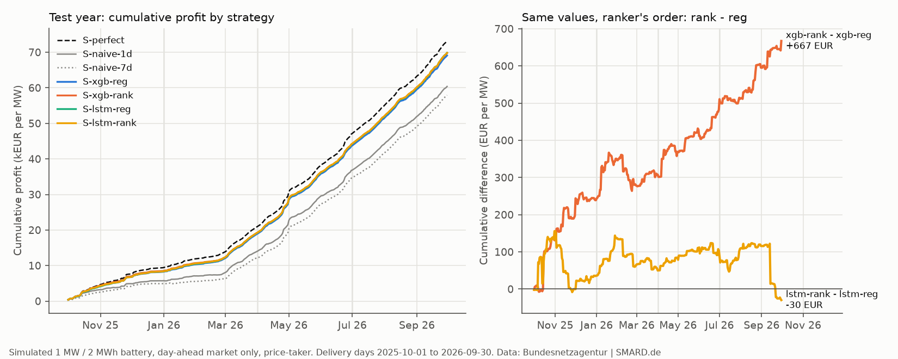
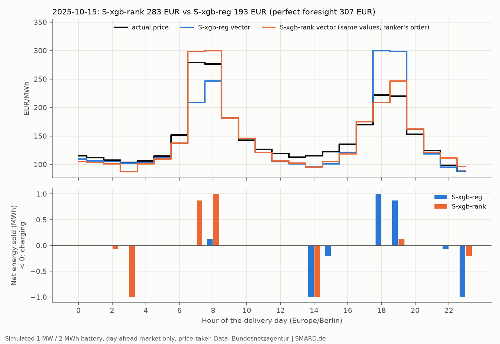

# Exploratory analyses after the test run (PLAN.md §8, session S4)

Exploratory: these are not tests. The pre-registered verdicts are in `results/test_summary.md` and are not changed by anything here. Simulated 1 MW / 2 MWh battery (unless stated), day-ahead market only, price-taker. CIs: the §6 moving-block bootstrap (7-day blocks, 10,000 resamples, seed 20261004). Rounded for display; the CSV files next to this one hold the raw numbers.

## Test-year forecasts used here

Regenerated with the frozen backtest code: 48 of 48 fits found the same number of trees or epochs as the official run; largest absolute difference in daily profit against `results/test_daily_profit.csv`, over all strategies and days: 2.27e-13 EUR.

## A. Sensitivity: the same test forecasts re-dispatched (no retraining)

Other durations keep 1 MW, start and end each day at 50% charge and allow one full cycle per day.

| Setting (EUR/MW/year) | S-lstm-rank | S-lstm-reg | S-naive-1d | S-naive-7d | S-xgb-rank | S-xgb-reg |
|---|---|---|---|---|---|---|
| 1 h (1 MW / 1 MWh) | 35777 | 35797 | 30821 | 29431 | 35838 | 35416 |
| 4 h (1 MW / 4 MWh) | 124783 | 124545 | 109088 | 108304 | 124712 | 123716 |
| base: 2 h, 10 EUR/MWh | 69834 | 69864 | 60390 | 57936 | 69774 | 69107 |
| degradation 0 EUR/MWh | 77025 | 77069 | 67581 | 65273 | 77021 | 76276 |
| degradation 20 EUR/MWh | 62830 | 62867 | 53273 | 50788 | 62736 | 62020 |

| Setting (capture) | S-lstm-rank | S-lstm-reg | S-naive-1d | S-naive-7d | S-xgb-rank | S-xgb-reg |
|---|---|---|---|---|---|---|
| 1 h (1 MW / 1 MWh) | 94.4% | 94.4% | 81.3% | 77.6% | 94.5% | 93.4% |
| 4 h (1 MW / 4 MWh) | 97.2% | 97.0% | 84.9% | 84.3% | 97.1% | 96.3% |
| base: 2 h, 10 EUR/MWh | 95.4% | 95.5% | 82.5% | 79.2% | 95.3% | 94.4% |
| degradation 0 EUR/MWh | 95.9% | 96.0% | 84.1% | 81.3% | 95.9% | 95.0% |
| degradation 20 EUR/MWh | 94.7% | 94.7% | 80.3% | 76.5% | 94.6% | 93.5% |

| Setting | Comparison | S-perfect (EUR/MW/year) | Mean daily diff (EUR) | 95% CI | Annual diff (EUR/MW) | Share of reg's gap to perfect closed |
|---|---|---|---|---|---|---|
| base: 2 h, 10 EUR/MWh | S-xgb-rank - S-xgb-reg | 73181 | 1.83 | 0.78 to 2.84 | 667 | 16.4% |
| base: 2 h, 10 EUR/MWh | S-lstm-rank - S-lstm-reg | 73181 | -0.08 | -1.19 to 1.03 | -30 | -0.9% |
| degradation 0 EUR/MWh | S-xgb-rank - S-xgb-reg | 80319 | 2.04 | 0.99 to 3.06 | 745 | 18.4% |
| degradation 0 EUR/MWh | S-lstm-rank - S-lstm-reg | 80319 | -0.12 | -1.22 to 0.98 | -45 | -1.4% |
| degradation 20 EUR/MWh | S-xgb-rank - S-xgb-reg | 66351 | 1.96 | 0.93 to 2.99 | 716 | 16.5% |
| degradation 20 EUR/MWh | S-lstm-rank - S-lstm-reg | 66351 | -0.1 | -1.21 to 1.01 | -36 | -1.0% |
| 1 h (1 MW / 1 MWh) | S-xgb-rank - S-xgb-reg | 37919 | 1.15 | 0.55 to 1.73 | 421 | 16.8% |
| 1 h (1 MW / 1 MWh) | S-lstm-rank - S-lstm-reg | 37919 | -0.05 | -1.3 to 0.99 | -19 | -0.9% |
| 4 h (1 MW / 4 MWh) | S-xgb-rank - S-xgb-reg | 128419 | 2.73 | 1.05 to 4.64 | 995 | 21.2% |
| 4 h (1 MW / 4 MWh) | S-lstm-rank - S-lstm-reg | 128419 | 0.65 | -0.4 to 1.59 | 239 | 6.2% |

## A. Robustness (no TSO generation forecasts) and D. tree-count check: H1's statistic

`official` is the pre-registered run (verdict: supported). `no_gen_forecasts` drops the 15 features built from TSO wind and PV forecasts (the load forecast stays) and repeats the §6 fit procedure. `fixed_trees` uses every feature and the validation tree counts of `results/selected_*.json` at every refit (XGB-reg 467/223/571, XGB-rank 83/88/151 for seeds 0/1/2), without early stopping. Exploratory; no verdict.

| Variant | S-xgb-reg (EUR/MW/year) | S-xgb-rank (EUR/MW/year) | Mean daily diff (EUR) | 95% CI | Annual diff (EUR/MW) | Share of gap closed |
|---|---|---|---|---|---|---|
| official | 69107 | 69774 | 1.83 | 0.78 to 2.84 | 667 | 16.4% |
| no_gen_forecasts | 64659 | 66256 | 4.38 | 2.2 to 6.51 | 1597 | 18.7% |
| fixed_trees | 69358 | 69830 | 1.3 | 0.36 to 2.36 | 473 | 12.4% |

| Variant | Strategy | RMSE (EUR/MWh) | Spearman rho | Hit 2 cheapest | Hit 2 dearest |
|---|---|---|---|---|---|
| official | S-xgb-reg | 30.26 | 0.936 | 69.3% | 71.5% |
| official | S-xgb-rank | 30.01 | 0.952 | 73.7% | 74.9% |
| no_gen_forecasts | S-xgb-reg | 38.36 | 0.858 | 58.9% | 61.5% |
| no_gen_forecasts | S-xgb-rank | 38.01 | 0.887 | 65.1% | 64.9% |
| fixed_trees | S-xgb-reg | 29.2 | 0.94 | 70.8% | 72.5% |
| fixed_trees | S-xgb-rank | 28.99 | 0.952 | 73.2% | 74.8% |

| Variant | Quarter from | Mean daily diff (EUR) | XGB-reg trees (s0/s1/s2) | XGB-rank trees (s0/s1/s2) |
|---|---|---|---|---|
| official | 2025-10-01 | 2.6 | 616/858/810 | 69/70/188 |
| official | 2026-01-01 | 0.76 | 39/48/43 | 231/124/174 |
| official | 2026-04-01 | 1.93 | 67/56/64 | 171/176/146 |
| official | 2026-07-01 | 2.01 | 718/778/427 | 182/251/92 |
| no_gen_forecasts | 2025-10-01 | 4.74 | 234/178/217 | 91/142/66 |
| no_gen_forecasts | 2026-01-01 | 1.88 | 59/50/59 | 183/141/184 |
| no_gen_forecasts | 2026-04-01 | 5.65 | 62/71/52 | 111/178/123 |
| no_gen_forecasts | 2026-07-01 | 5.18 | 284/227/248 | 170/210/211 |
| fixed_trees | 2025-10-01 | 2.32 | 467/223/571 | 83/88/151 |
| fixed_trees | 2026-01-01 | 0.1 | 467/223/571 | 83/88/151 |
| fixed_trees | 2026-04-01 | 1.52 | 467/223/571 | 83/88/151 |
| fixed_trees | 2026-07-01 | 1.21 | 467/223/571 | 83/88/151 |

## A. Stability: PSI of the 10 most important features

Importance: total gain of the selected XGB-reg and XGB-rank (seed 0) fitted on the training period, each normalised to 1, averaged. PSI bins: training deciles plus a missing bin. Usual reading: < 0.1 stable, 0.1-0.25 moderate shift, > 0.25 large shift.

| Rank | Feature | Importance | TSO generation forecast | PSI test vs train | PSI validation vs train |
|---|---|---|---|---|---|
| 1 | price_lag1 | 0.28 | False | 1.051 | 0.969 |
| 2 | residual_load_fc_dev | 0.19 | True | 0.17 | 0.064 |
| 3 | residual_load_fc_rank | 0.188 | True | 0.0 | 0.0 |
| 4 | price_lag1_day_mean | 0.064 | False | 1.549 | 0.928 |
| 5 | price_lag7 | 0.048 | False | 1.06 | 0.95 |
| 6 | price_profile28 | 0.046 | False | 0.071 | 0.035 |
| 7 | residual_load_fc | 0.026 | True | 0.145 | 0.068 |
| 8 | price_lag1_day_max | 0.017 | False | 1.724 | 1.829 |
| 9 | wind_pv_share | 0.011 | True | 0.148 | 0.06 |
| 10 | price_lag7_rank | 0.01 | False | 0.0 | 0.0 |

## A. Every metric by quarter (test year)

VaR 5% = P5 of daily profit, ES 5% = mean of the worst 5% of the quarter's days (5 days); both are profit levels, negative = loss.

| Quarter from | Strategy | Profit (EUR/MW) | Capture | RMSE | MAE | Spearman rho | Hit 2 cheapest | Hit 2 dearest | VaR 5%: P5 (EUR) | ES 5%: worst 5% (EUR) | Losing days | Max drawdown (EUR) |
|---|---|---|---|---|---|---|---|---|---|---|---|---|
| 2025-10-01 | S-perfect | 9404 | 100.0% | 0.0 | 0.0 | 1.0 | 100.0% | 100.0% | 13.157 | 7.026 | 0.0% | 0.0 |
| 2025-10-01 | S-naive-1d | 5741 | 61.1% | 40.215 | 25.734 | 0.685 | 33.7% | 42.9% | -15.429 | -25.494 | 16.3% | 51.908 |
| 2025-10-01 | S-naive-7d | 4936 | 52.5% | 51.472 | 34.608 | 0.697 | 34.8% | 45.7% | -14.518 | -27.274 | 18.5% | 46.574 |
| 2025-10-01 | S-xgb-reg | 8253 | 87.8% | 22.914 | 14.951 | 0.908 | 57.1% | 62.0% | 4.925 | -3.354 | 3.3% | 15.97 |
| 2025-10-01 | S-xgb-rank | 8492 | 90.3% | 22.554 | 14.776 | 0.921 | 57.1% | 67.4% | 7.833 | -2.613 | 3.3% | 13.144 |
| 2025-10-01 | S-lstm-reg | 8322 | 88.5% | 21.912 | 15.099 | 0.918 | 61.4% | 65.8% | 7.549 | -0.98 | 2.2% | 11.306 |
| 2025-10-01 | S-lstm-rank | 8357 | 88.9% | 21.83 | 15.009 | 0.924 | 58.7% | 67.4% | 9.139 | -1.602 | 3.3% | 11.265 |
| 2026-01-01 | S-perfect | 11436 | 100.0% | 0.0 | 0.0 | 1.0 | 100.0% | 100.0% | 20.805 | 17.45 | 0.0% | 0.0 |
| 2026-01-01 | S-naive-1d | 8185 | 71.6% | 39.656 | 27.46 | 0.691 | 38.9% | 45.6% | -17.559 | -35.435 | 13.3% | 61.394 |
| 2026-01-01 | S-naive-7d | 7183 | 62.8% | 45.485 | 31.441 | 0.71 | 44.4% | 49.4% | -2.207 | -52.45 | 7.8% | 222.304 |
| 2026-01-01 | S-xgb-reg | 10567 | 92.4% | 20.085 | 13.966 | 0.916 | 57.8% | 71.7% | 12.806 | 8.624 | 1.1% | 0.338 |
| 2026-01-01 | S-xgb-rank | 10635 | 93.0% | 19.866 | 13.805 | 0.941 | 68.9% | 74.4% | 11.445 | 6.103 | 0.0% | 0.0 |
| 2026-01-01 | S-lstm-reg | 10767 | 94.2% | 18.217 | 13.487 | 0.928 | 58.9% | 73.3% | 10.426 | 5.683 | 0.0% | 0.0 |
| 2026-01-01 | S-lstm-rank | 10787 | 94.3% | 18.08 | 13.407 | 0.946 | 67.8% | 75.0% | 12.556 | 7.901 | 0.0% | 0.0 |
| 2026-04-01 | S-perfect | 26152 | 100.0% | 0.0 | 0.0 | 1.0 | 100.0% | 100.0% | 93.956 | 74.363 | 0.0% | 0.0 |
| 2026-04-01 | S-naive-1d | 22870 | 87.4% | 54.912 | 32.565 | 0.859 | 70.3% | 64.3% | 59.827 | 19.567 | 2.2% | 51.12 |
| 2026-04-01 | S-naive-7d | 22479 | 86.0% | 65.648 | 40.435 | 0.853 | 65.9% | 60.4% | 54.444 | 28.036 | 0.0% | 0.0 |
| 2026-04-01 | S-xgb-reg | 24787 | 94.8% | 35.722 | 18.939 | 0.965 | 82.4% | 78.6% | 80.679 | 60.942 | 0.0% | 0.0 |
| 2026-04-01 | S-xgb-rank | 24963 | 95.5% | 35.565 | 18.81 | 0.975 | 85.2% | 81.9% | 81.584 | 66.022 | 0.0% | 0.0 |
| 2026-04-01 | S-lstm-reg | 24966 | 95.5% | 34.097 | 19.08 | 0.973 | 84.1% | 83.5% | 86.455 | 65.357 | 0.0% | 0.0 |
| 2026-04-01 | S-lstm-rank | 25015 | 95.6% | 34.191 | 19.129 | 0.974 | 82.4% | 83.5% | 78.055 | 65.833 | 0.0% | 0.0 |
| 2026-07-01 | S-perfect | 26188 | 100.0% | 0.0 | 0.0 | 1.0 | 100.0% | 100.0% | 87.204 | 76.981 | 0.0% | 0.0 |
| 2026-07-01 | S-naive-1d | 23594 | 90.1% | 52.465 | 33.511 | 0.89 | 71.2% | 64.1% | 76.738 | 57.823 | 0.0% | 0.0 |
| 2026-07-01 | S-naive-7d | 23338 | 89.1% | 64.503 | 42.94 | 0.914 | 64.1% | 56.5% | 68.107 | 60.025 | 0.0% | 0.0 |
| 2026-07-01 | S-xgb-reg | 25499 | 97.4% | 38.098 | 28.885 | 0.956 | 79.9% | 73.9% | 82.015 | 70.054 | 0.0% | 0.0 |
| 2026-07-01 | S-xgb-rank | 25684 | 98.1% | 37.782 | 28.77 | 0.972 | 83.7% | 76.1% | 82.109 | 71.651 | 0.0% | 0.0 |
| 2026-07-01 | S-lstm-reg | 25809 | 98.5% | 35.607 | 27.494 | 0.961 | 85.3% | 69.6% | 82.691 | 69.707 | 0.0% | 0.0 |
| 2026-07-01 | S-lstm-rank | 25675 | 98.0% | 35.253 | 27.32 | 0.973 | 85.9% | 76.6% | 83.252 | 72.805 | 0.0% | 0.0 |

## A. Capture rate by month (test year)

| month | S-perfect (EUR/MW) | S-naive-1d | S-naive-7d | S-xgb-reg | S-xgb-rank | S-lstm-reg | S-lstm-rank |
|---|---|---|---|---|---|---|---|
| 2025-10 | 4588 | 70.1% | 54.6% | 91.7% | 94.5% | 88.8% | 92.2% |
| 2025-11 | 3030 | 56.1% | 54.2% | 84.6% | 86.8% | 88.9% | 83.8% |
| 2025-12 | 1787 | 46.3% | 44.1% | 83.0% | 85.4% | 86.9% | 88.9% |
| 2026-01 | 2487 | 54.1% | 25.0% | 84.0% | 88.4% | 85.8% | 89.9% |
| 2026-02 | 1872 | 44.9% | 38.3% | 86.2% | 82.5% | 91.2% | 87.3% |
| 2026-03 | 7078 | 84.8% | 82.6% | 97.0% | 97.4% | 97.9% | 97.7% |
| 2026-04 | 8643 | 87.0% | 81.0% | 96.8% | 97.5% | 97.5% | 97.8% |
| 2026-05 | 8571 | 92.6% | 93.5% | 98.2% | 98.9% | 98.6% | 98.9% |
| 2026-06 | 8939 | 82.9% | 83.5% | 89.5% | 90.1% | 90.5% | 90.5% |
| 2026-07 | 7830 | 92.2% | 86.9% | 98.1% | 98.5% | 97.9% | 98.0% |
| 2026-08 | 8158 | 94.1% | 92.0% | 98.0% | 99.0% | 98.7% | 98.8% |
| 2026-09 | 10200 | 85.3% | 88.5% | 96.3% | 97.0% | 98.9% | 97.5% |

## Distribution of daily profit (test year, EUR per day)

| strategy | min | P1 | P5 | P25 | P50 | P75 | P95 | P99 | max |
|---|---|---|---|---|---|---|---|---|---|
| S-perfect | 0.0 | 10.7 | 21.7 | 74.8 | 187.6 | 283.3 | 434.2 | 723.3 | 1265.8 |
| S-naive-1d | -61.4 | -31.8 | -7.6 | 36.5 | 153.3 | 259.8 | 400.0 | 535.2 | 1259.2 |
| S-naive-7d | -222.3 | -25.2 | -2.6 | 31.3 | 142.1 | 260.5 | 371.4 | 593.2 | 1216.0 |
| S-xgb-reg | -16.0 | 2.7 | 14.8 | 65.5 | 182.0 | 276.3 | 424.9 | 595.7 | 1262.6 |
| S-xgb-rank | -13.1 | 3.5 | 15.2 | 68.6 | 182.8 | 279.4 | 429.1 | 601.9 | 1262.6 |
| S-lstm-reg | -11.3 | 4.5 | 14.8 | 64.1 | 182.4 | 275.2 | 424.4 | 635.3 | 1262.6 |
| S-lstm-rank | -11.3 | 4.3 | 15.3 | 67.1 | 180.2 | 276.3 | 425.3 | 605.5 | 1256.7 |

## B. Accuracy vs value (validation year, every single-seed fit of the S2 search)

Rank correlation (Spearman) between each accuracy metric and validation profit. A ranker's RMSE is that of its "-rank" vector (the selected price model's values in its order).

| Fits | Metric | n | Rank corr. with profit | p-value |
|---|---|---|---|---|
| all fits | vector_rmse_eur_mwh | 58 | -0.592 | 0.0 |
| all fits | vector_spearman_rho_mean | 58 | 0.871 | 0.0 |
| lstm-rank | vector_rmse_eur_mwh | 8 | -0.762 | 0.028 |
| lstm-rank | vector_spearman_rho_mean | 8 | 0.595 | 0.12 |
| lstm-reg | vector_rmse_eur_mwh | 8 | -0.071 | 0.867 |
| lstm-reg | vector_spearman_rho_mean | 8 | 0.5 | 0.207 |
| xgb-rank | vector_rmse_eur_mwh | 21 | -0.404 | 0.069 |
| xgb-rank | vector_spearman_rho_mean | 21 | 0.066 | 0.775 |
| xgb-reg | vector_rmse_eur_mwh | 21 | -0.361 | 0.108 |
| xgb-reg | vector_spearman_rho_mean | 21 | 0.769 | 0.0 |

## C. Where profit is lost

Gap = perfect-foresight profit minus the strategy's, in EUR per day. Order only: the true prices put in the model's order (price model for "-reg", ranker for "-rank"). Values only: the price model's values put in the true order (the same for reg and rank). Interaction = gap - order only - values only.

| Period | Strategy | Profit (EUR/day) | Gap to perfect | Order only | Values only | Interaction |
|---|---|---|---|---|---|---|
| test year | S-xgb-reg | 189.33 | 11.16 | 7.61 | 3.88 | -0.32 |
| test year | S-xgb-rank | 191.16 | 9.33 | 5.73 | 3.88 | -0.28 |
| test year | S-lstm-reg | 191.41 | 9.09 | 6.19 | 3.57 | -0.67 |
| test year | S-lstm-rank | 191.33 | 9.17 | 5.85 | 3.57 | -0.25 |
| 2025-10-01 | S-xgb-reg | 89.71 | 12.51 | 11.25 | 2.66 | -1.4 |
| 2025-10-01 | S-xgb-rank | 92.31 | 9.92 | 8.58 | 2.66 | -1.33 |
| 2025-10-01 | S-lstm-reg | 90.45 | 11.77 | 9.88 | 2.57 | -0.68 |
| 2025-10-01 | S-lstm-rank | 90.84 | 11.38 | 9.81 | 2.57 | -0.99 |
| 2026-01-01 | S-xgb-reg | 117.42 | 9.65 | 9.25 | 1.58 | -1.18 |
| 2026-01-01 | S-xgb-rank | 118.17 | 8.89 | 7.53 | 1.58 | -0.22 |
| 2026-01-01 | S-lstm-reg | 119.63 | 7.43 | 7.6 | 1.2 | -1.36 |
| 2026-01-01 | S-lstm-rank | 119.86 | 7.21 | 7.16 | 1.2 | -1.15 |
| 2026-04-01 | S-xgb-reg | 272.39 | 15.0 | 5.42 | 8.76 | 0.82 |
| 2026-04-01 | S-xgb-rank | 274.32 | 13.07 | 3.71 | 8.76 | 0.61 |
| 2026-04-01 | S-lstm-reg | 274.35 | 13.03 | 3.66 | 9.55 | -0.18 |
| 2026-04-01 | S-lstm-rank | 274.89 | 12.5 | 3.26 | 9.55 | -0.31 |
| 2026-07-01 | S-xgb-reg | 277.16 | 7.49 | 4.51 | 2.53 | 0.46 |
| 2026-07-01 | S-xgb-rank | 279.17 | 5.48 | 3.12 | 2.53 | -0.16 |
| 2026-07-01 | S-lstm-reg | 280.53 | 4.13 | 3.61 | 0.99 | -0.48 |
| 2026-07-01 | S-lstm-rank | 279.08 | 5.58 | 3.17 | 0.99 | 1.42 |

Forecast metrics of the price vectors by quarter:

| Period | Strategy | RMSE (EUR/MWh) | Spearman rho | Hit 2 cheapest | Hit 2 dearest |
|---|---|---|---|---|---|
| test year | S-xgb-reg | 30.26 | 0.936 | 69.3% | 71.5% |
| test year | S-xgb-rank | 30.01 | 0.952 | 73.7% | 74.9% |
| test year | S-lstm-reg | 28.5 | 0.945 | 72.5% | 73.0% |
| test year | S-lstm-rank | 28.38 | 0.954 | 73.7% | 75.6% |
| 2025-10-01 | S-xgb-reg | 22.91 | 0.908 | 57.1% | 62.0% |
| 2025-10-01 | S-xgb-rank | 22.55 | 0.921 | 57.1% | 67.4% |
| 2025-10-01 | S-lstm-reg | 21.91 | 0.918 | 61.4% | 65.8% |
| 2025-10-01 | S-lstm-rank | 21.83 | 0.924 | 58.7% | 67.4% |
| 2026-01-01 | S-xgb-reg | 20.08 | 0.916 | 57.8% | 71.7% |
| 2026-01-01 | S-xgb-rank | 19.87 | 0.941 | 68.9% | 74.4% |
| 2026-01-01 | S-lstm-reg | 18.22 | 0.928 | 58.9% | 73.3% |
| 2026-01-01 | S-lstm-rank | 18.08 | 0.946 | 67.8% | 75.0% |
| 2026-04-01 | S-xgb-reg | 35.72 | 0.965 | 82.4% | 78.6% |
| 2026-04-01 | S-xgb-rank | 35.56 | 0.975 | 85.2% | 81.9% |
| 2026-04-01 | S-lstm-reg | 34.1 | 0.973 | 84.1% | 83.5% |
| 2026-04-01 | S-lstm-rank | 34.19 | 0.974 | 82.4% | 83.5% |
| 2026-07-01 | S-xgb-reg | 38.1 | 0.956 | 79.9% | 73.9% |
| 2026-07-01 | S-xgb-rank | 37.78 | 0.972 | 83.7% | 76.1% |
| 2026-07-01 | S-lstm-reg | 35.61 | 0.961 | 85.3% | 69.6% |
| 2026-07-01 | S-lstm-rank | 35.25 | 0.973 | 85.9% | 76.6% |

Paired differences of the daily within-day Spearman rho (test year, block bootstrap):

| comparison | days | mean_daily_spearman_diff | ci95_low | ci95_high |
|---|---|---|---|---|
| S-xgb-rank - S-xgb-reg | 365 | 0.0158 | 0.0127 | 0.0187 |
| S-lstm-reg - S-xgb-reg | 365 | 0.0085 | 0.0053 | 0.0122 |
| S-xgb-rank - S-lstm-reg | 365 | 0.0073 | 0.0041 | 0.0101 |
| S-lstm-rank - S-lstm-reg | 365 | 0.0092 | 0.0057 | 0.0122 |

LSTM, Jul-Sep 2026: the 10 days where S-lstm-rank loses most against S-lstm-reg (EUR). `order_diff_true_values` = (true prices in the ranker's order) - (true prices in LSTM-reg's order).

| delivery_day | S-perfect | S-lstm-reg | S-lstm-rank | diff | order_diff_true_values |
|---|---|---|---|---|---|
| 2026-09-14 | 741.07 | 733.95 | 626.11 | -107.84 | -3.83 |
| 2026-09-22 | 622.06 | 620.25 | 593.93 | -26.33 | 1.68 |
| 2026-07-13 | 225.69 | 224.61 | 205.13 | -19.48 | -20.08 |
| 2026-07-02 | 255.79 | 247.34 | 230.06 | -17.28 | -15.69 |
| 2026-07-01 | 196.64 | 182.42 | 167.07 | -15.35 | 14.27 |
| 2026-08-06 | 295.34 | 291.56 | 279.05 | -12.51 | -13.47 |
| 2026-09-21 | 392.06 | 391.45 | 383.3 | -8.15 | -1.75 |
| 2026-08-23 | 289.71 | 288.96 | 281.12 | -7.84 | -7.35 |
| 2026-07-26 | 269.18 | 266.28 | 259.52 | -6.76 | -7.66 |
| 2026-07-14 | 177.27 | 176.84 | 170.12 | -6.72 | -6.74 |

## E. Figures

Day with the largest |S-xgb-rank - S-xgb-reg| profit difference: 2025-10-15.

## F. Conformal quantiles and the CVaR frontier (stretch)

XGB-quantile (19 levels, XGB-reg's hyperparameters, seed 0) fitted once on the training period, calibrated by CQR on the validation year, applied to the test year without refits. 200 scenarios per day: Gaussian copula with the within-day residual correlation of the training period, marginals from the calibrated quantiles (linear tails beyond 5% and 95%). Schedule: maximise mean scenario profit - lambda x CVaR 95% of the loss (Rockafellar-Uryasev), OR-Tools SCIP, re-solved with HiGHS; settled at the actual prices.

| set | pinball_loss_eur_mwh | coverage 90% | coverage 80% | coverage 70% | coverage 60% | coverage 50% | coverage 40% | coverage 30% | coverage 20% | coverage 10% |
|---|---|---|---|---|---|---|---|---|---|---|
| validation, raw | 6.386 | 0.861 | 0.757 | 0.649 | 0.552 | 0.452 | 0.36 | 0.272 | 0.179 | 0.091 |
| test, raw | 7.795 | 0.85 | 0.719 | 0.607 | 0.509 | 0.416 | 0.325 | 0.238 | 0.156 | 0.076 |
| test, CQR-calibrated | 7.766 | 0.886 | 0.758 | 0.648 | 0.544 | 0.451 | 0.356 | 0.263 | 0.175 | 0.083 |

| Schedule | Profit (EUR/MW/year) | Capture | Mean daily profit (EUR) | VaR 5%: P5 (EUR) | ES 5%: worst 5% (EUR) | Losing days | Max drawdown (EUR) |
|---|---|---|---|---|---|---|---|
| lambda 0 | 68821 | 94.0% | 188.55 | 13.95 | 5.94 | 0.5% | 21.97 |
| lambda 0.5 | 65524 | 89.5% | 179.52 | 10.85 | 1.96 | 0.8% | 17.81 |
| lambda 1 | 63180 | 86.3% | 173.1 | 8.68 | 1.58 | 0.5% | 13.62 |
| lambda 2 | 59414 | 81.2% | 162.78 | 0.15 | -0.58 | 0.5% | 8.47 |
| lambda 5 | 55989 | 76.5% | 153.39 | 0.0 | -0.26 | 0.3% | 5.02 |
| S-xgb-reg | 69107 | 94.4% | 189.33 | 14.81 | 5.68 | 1.1% | 15.97 |

## F. SHAP: top 10 features on the test year (stretch)

Mean |SHAP| (TreeSHAP) of the training-period XGB-reg (EUR/MWh) and XGB-rank (score units).

| Model | Rank | Feature | Mean |SHAP| | Share of total | TSO generation forecast |
|---|---|---|---|---|---|
| xgb-reg | 1 | residual_load_fc | 17.738 | 18.1% | True |
| xgb-reg | 2 | price_lag1 | 12.313 | 12.5% | False |
| xgb-reg | 3 | price_lag7 | 10.634 | 10.8% | False |
| xgb-reg | 4 | wind_pv_share | 6.023 | 6.1% | True |
| xgb-reg | 5 | residual_load_fc_dev | 5.618 | 5.7% | True |
| xgb-reg | 6 | price_lag1_day_mean | 4.95 | 5.0% | False |
| xgb-reg | 7 | price_lag1_day_spread | 3.972 | 4.0% | False |
| xgb-reg | 8 | residual_load_actual_lag7 | 2.968 | 3.0% | False |
| xgb-reg | 9 | price_lag1_day_max | 2.691 | 2.7% | False |
| xgb-reg | 10 | price_lag7_day_mean | 2.655 | 2.7% | False |
| xgb-rank | 1 | residual_load_fc_dev | 1.191 | 39.6% | True |
| xgb-rank | 2 | residual_load_fc_rank | 0.672 | 22.4% | True |
| xgb-rank | 3 | price_profile28 | 0.3 | 10.0% | False |
| xgb-rank | 4 | price_lag7_rank | 0.121 | 4.0% | False |
| xgb-rank | 5 | local_hour | 0.103 | 3.4% | False |
| xgb-rank | 6 | price_lag1_rank | 0.087 | 2.9% | False |
| xgb-rank | 7 | residual_load_fc | 0.062 | 2.1% | True |
| xgb-rank | 8 | load_fc | 0.058 | 1.9% | False |
| xgb-rank | 9 | residual_load_fc_day_mean | 0.044 | 1.5% | True |
| xgb-rank | 10 | load_actual_lag7 | 0.037 | 1.2% | False |
